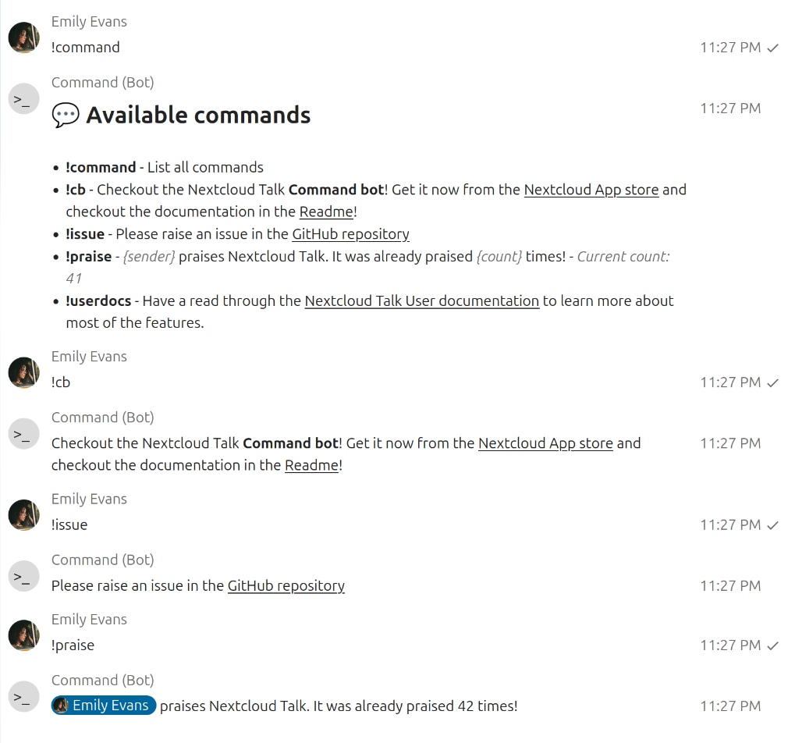

# Command Bot for Nextcloud Talk

A simple "text in, text out" bot to help with repeating questions and tasks.

## 💬 Default commands for all participants
- **!command** - List all commands

## ⭐ Commands for moderators only
- **!set** - Create or update a command
  ```
  !set !counter The counter was used {count} times
  ```
- **!unset** - Remove a command
  ```
  !unset !counter
  ```
### 💱 Available placeholders
- **{sender}** - Replaced with a mention of the sender
- **{mention}** - Replaced with the first mention in the command
- **{text}** - All text that was provided after the command
- **{count}** - A counter how often the command was triggered already



## 💡 Ideas for commands you could add depending on your use case

Simply post each command you'd like to add as a new message into your chat.

### 💛 Caring

```
!set !hug {sender} shows {mention} some love! 💛
!set !praiseall {sender} praises the community! Thanks everyone for being awesome! We all have been praised already {count} times!
```

### 📚 Helping each other

```
!set !english The prefered language is English. This allows more people to understand discussions and participate in them.
!set !cb Checkout the Nextcloud Talk **Command bot**! Get it now from the [Nextcloud App store](https://apps.nextcloud.com/apps/command_bot) and checkout the documentation in the [Readme](https://github.com/nextcloud/command_bot)!
!set !userdocs Have a read through the [Nextcloud Talk User documentation](https://docs.nextcloud.com/server/latest/user_manual/en/talk/index.html) to learn more about most of the features.
!set !issue Please raise an issue in the GitHub repository: https://github.com/nextcloud/command_bot/issues/new/choose
```

### 🗜️ Shortcutting

```
!set !brb {sender} is right back! 🔙
!set !afk {sender} went to see the world!🚶‍➡️
!set !re {sender} is back at the desk! 💻
```
